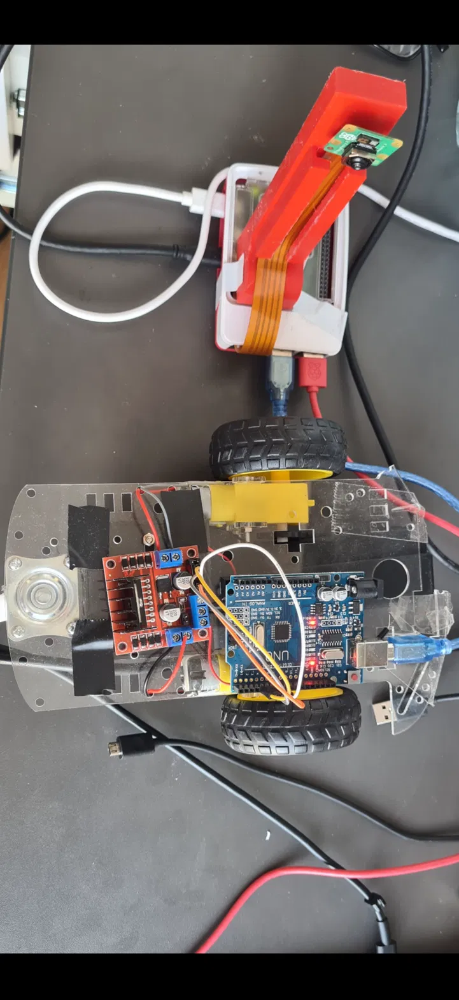

https://github.com/user-attachments/assets/764b5aef-a273-42f5-b918-a8af4e4050a7

# Real-Time Stop Sign Detection and Vehicle Control

A Raspberry Pi 5 perception system that classifies stop signs from a live camera feed and
brings an Arduino-driven chassis to a controlled stop.

Final year individual project (EG3005), BEng Mechanical Engineering, University of Leicester,
2024–25.

> **On dates.** The written report for this project was submitted on 7 April 2025, before the
> system worked end to end. Development continued, and the working system was completed on
> 28–29 April and demonstrated at the project presentation. **This repository documents the
> April 29 system.** Where the report and this repository disagree, the report describes an
> earlier state. See [PROVENANCE.md](PROVENANCE.md).

---

## What this is

A mechanical engineering student's route into applied machine learning: take a physical
vehicle — chassis, motors, H-bridge, wiring — put a learned perception system in front of it,
and close the loop so what the camera sees changes what the motors do.

The interesting engineering turned out to be in three places: making a camera stack, a
TensorFlow graph and a motor driver agree on timing; designing a mount rigid enough that the
camera wasn't the limiting factor; and working out *why* the model was right, because for a
long time it was right for the wrong reason.

**Hardware:** Raspberry Pi 5 · Camera Module 3 (IMX708) · Arduino Uno · L298N dual H-bridge ·
2WD chassis · custom 3D-printed camera mount. Build cost £208.


**Software:** Python · TensorFlow/Keras · OpenCV · Picamera2 · Arduino C++ · SolidWorks

---

## The finding worth reading

The first model reached 93–95% validation accuracy and then classified a red wall as a stop
sign at 68.5% confidence. A red "GO" sign scored 57.0% — a confident false positive on a sign
meaning the opposite. Sunglasses on a neutral background were correctly rejected.

The model had learned **red**, not *octagonal red sign with white text*. It scored well because
the validation set carried the same bias as the training set: most positives were
red-dominant and shot in one indoor environment.

**The fix was data, not architecture.** Retraining added 900+ deliberately confusing negatives
— a green stop sign, a red GO sign, a 30mph sign — sourced through Roboflow, plus brightness
and geometric augmentation. Test accuracy on a held-out set: **90.62%**.

The colour bias was reduced, not eliminated. The distractors still scored high. What made the
system usable was measuring where the margin actually was: a real stop sign reached 90%+ at
around 30cm from the camera, while the distractors stayed below 86%. The threshold was set at
88% on the Pi and 86% on the Arduino to sit inside that gap.

That is an honest description of an engineering decision under a deadline — exploiting a
measured separating margin in a model known to be imperfect, rather than claiming the
underlying problem was solved.

---

## Pipeline

```

```

The Arduino does not simply cut power. It ramps PWM down over 1 second, holds a full stop for
5 seconds, then enters a 5-second cooldown and flushes its confidence buffer before it will
consider another stop. Each of those exists because of a specific observed failure — see
below.

---

## Results

| Metric | Value |
|--------|-------|
| Dataset | 1,481 stop-sign images + 900+ hard negatives |
| Input | 64×64×3 |
| Loss | binary cross-entropy, sigmoid output |
| **Test accuracy (held-out)** | **90.62%** |
| Validation peak | 95.31% (run 1), 97.52% (run 2) |
| Detection threshold | 88% (Pi), 86% (Arduino, 5-frame mean) |
| Reliable detection distance | ~30cm |

Class mapping is `{'non_stop_sign': 0, 'stop_sign': 1}` and is pickled at training time so the
inference script cannot silently disagree with the model. An earlier iteration of this project
had exactly that bug.

**Inference rate is not stated here.** No frame-rate measurement was ever taken. A figure of
"~15 FPS" appears in the presentation slides; it was not measured and should not be relied on.
Measuring it properly is listed under future work.

---

## Debugging log

Each of these was an observed failure with a specific fix, in order:

| Symptom | Cause | Fix |
|---|---|---|
| Motors dead, no error | No common ground between Arduino and L298N | Tie grounds |
| One wheel static | Wrong IN-pin mapping | 7/6/5/4 with ENA=9, ENB=10 |
| Both wheels opposing | Motor mounted mirrored | Reverse one motor's output leads |
| High confidence on a red wall | Model learned colour, not shape | Hard negatives + augmentation |
| Harsh, unrealistic stop | Instant power cut | 1-second PWM brake ramp |
| Stop timer reset by frame noise | Confidence fluctuated during the stop | Latch the stop, ignore serial while stopped |
| Car re-stopped 5s after resuming | Stale high-confidence frames in the buffer | Flush buffer on resume, add cooldown |
| Single-frame false triggers | Any one frame could fire a stop | 5-frame rolling mean, discard frames <70% |

---

## Repository layout

```
├── train_cnn.py                  Trains the binary classifier, pickles the class mapping
├── requirements.txt              Reconstructed — see header note
├── inference/
│   ├── detect_live.py            Live detection + serial to Arduino (RECONSTRUCTED)
│   └── test_static.py            Runs the model against a saved still image
├── camera/
│   ├── camera_test.py            Minimal Picamera2 feed test — run this first
│   └── capture_still.py          Captures a single frame for offline testing
├── arduino/
│   ├── stop_sign_controller/     Final controller: braking ramp, latch, cooldown
│   ├── motor_direction_test/     Continuous drive, verifies polarity and wiring
│   └── motor_pwm_test/           PWM ramp, verifies speed control
├── experiments/                  Superseded approaches — see experiments/README.md
├── mount/                        3D-printed camera mount (SolidWorks files to add)
├── docs/hardware.md              Wiring, pin mapping, and the four wiring gotchas
└── PROVENANCE.md                 Evidence trail for every claim above
```

---

## Hardware setup

| L298N | Arduino |
|-------|---------|
| IN1   | D7      |
| IN2   | D6      |
| IN3   | D5      |
| IN4   | D4      |
| ENA   | D9 (PWM) |
| ENB   | D10 (PWM) |
| GND   | GND     |

Motor A → OUT1/OUT2, Motor B → OUT3/OUT4. Battery positive to the L298N motor supply terminal,
battery negative to L298N GND.

- **Arduino and L298N must share a common ground.** Without it the motors do nothing and
  nothing reports an error.
- **Remove the ENA/ENB jumpers** before driving those pins with PWM.
- **One motor's output leads are reversed at the L298N** so both wheels drive the chassis the
  same way under identical logic levels. A wiring convention, not a software correction.

### Camera mount

The Pi and camera were initially hand-held during testing, so angle and height shifted between
captures and every frame carried shake. Two mounts were designed in SolidWorks: an L-bracket
fixing both at a set orientation, and a taller tripod form allowing the ribbon cable to be
removed without disassembly. The tripod was printed in PETG at 0.1mm layers, 20–25% infill.

It removed the shake and made capture angle repeatable — which did more for data quality than
any software change over the same period.

---

## Running it

```bash
python3 train_cnn.py    # set BASE to your dataset root first
```

Upload `arduino/stop_sign_controller/` to the Arduino **before** starting detection on the Pi, so it
is listening when the first line arrives.

The Pi virtualenv must be created with `--system-site-packages` or Picamera2 and
`python3-kms++` won't import, and the resulting error doesn't explain why.

---

## Known limitations

**This is a classifier, not a detector.** Trained on folder-level labels, so it predicts
whether the *whole frame* is a stop sign. It cannot localise one or produce a bounding box.
The dataset carries YOLO-format annotations that were never used for detection — genuine
detection means retraining on those boxes, not extending this pipeline.

**Colour bias is reduced, not solved.** Confusing negatives still score high; the system works
because the threshold sits in a measured gap. A different lighting environment could close
that gap.

**Detection range is short.** Reliable at roughly 30cm. At a realistic approach distance the
sign occupies too few pixels at 64×64 input.

**No frame-rate measurement exists.** See Results.

**Absolute paths are hardcoded** in the recovered scripts and need parameterising.

---

## Future work

- Measure inference rate properly and report it
- Move to true object detection with bounding boxes, using the existing YOLO-format annotations
- Outdoor testing across varied lighting
- Coral Edge TPU to lift inference throughput
- Smoother acceleration on resume

---

## Development notes

Parts of this codebase were developed with AI assistance. Every file is labelled in
`PROVENANCE.md` with whether it was tested on hardware and what evidence exists, because
"it was written" and "it was verified" are different claims and only one belongs in a
portfolio.

## License

MIT
