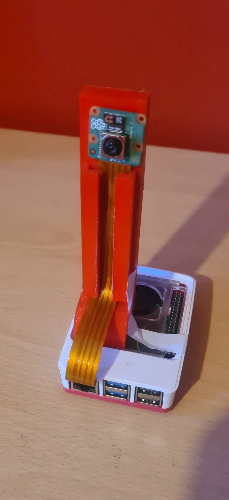
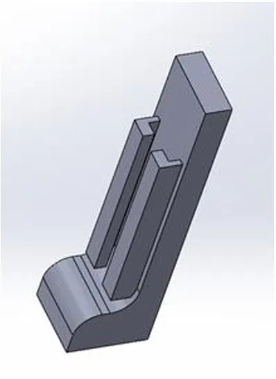
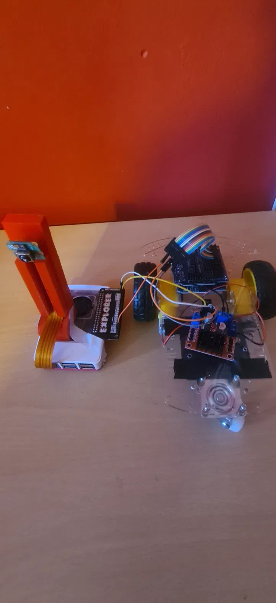

# Hardware

## Bill of materials

| Item | Purpose |
|---|---|
| Raspberry Pi 5 | Perception — camera capture and CNN inference |
| Camera Module 3 (IMX708) | 640×480 capture via Picamera2 |
| Arduino Uno | Motor control and stop-state logic |
| L298N dual H-bridge | Motor driver |
| 2WD chassis, 2× DC motors | Drivetrain |
| Battery pack | Motor supply, separate from Pi power |
| 3D-printed camera mount | PETG, fixes camera angle and height |

Total build cost: £208.

## Wiring

### Arduino → L298N

| L298N | Arduino |
|-------|---------|
| IN1   | D7      |
| IN2   | D6      |
| IN3   | D5      |
| IN4   | D4      |
| ENA   | D9 (PWM) |
| ENB   | D10 (PWM) |
| GND   | GND     |

Motor A → OUT1/OUT2. Motor B → OUT3/OUT4.
Battery positive → L298N motor supply terminal. Battery negative → L298N GND.

### Raspberry Pi → Arduino

USB cable, appearing as `/dev/ttyUSB0` on the Pi. 9600 baud, 8N1.
Note that opening the serial port resets the Arduino, so the Pi-side script
waits 2 seconds after opening before sending anything.

## Four things that cost real debugging time

**Common ground.** The Arduino GND and L298N GND must be tied together. Without
it the motors do nothing at all and no error appears anywhere. It presents as a
software problem and is not one.

**ENA/ENB jumpers.** These must be removed before driving those pins with PWM.
With the jumpers fitted the enable lines are held high and `analogWrite` has no
effect — the motors simply run flat out.

**One motor is mounted mirrored.** The two motors face opposite directions on
the chassis, so identical logic levels spin them opposite ways and the vehicle
turns on the spot. Fixed by physically reversing one motor's output leads at the
L298N. This is a wiring convention, not a software correction — if the chassis
is rewired, the swap must be preserved or every sketch in `arduino/` stops
meaning what it says.

**Pin mapping.** 7/6/5/4 with ENA=9, ENB=10 is the mapping that works and is
used throughout. A mapping of 2/3/4/5 was tried and left one wheel dead.

## Camera mount

The Pi and camera were initially hand-held during testing. Camera angle and
height shifted between captures and every frame carried shake, which made the
training data inconsistent in a way that was invisible until the model started
behaving oddly.

Two mounts were designed in SolidWorks: an L-bracket holding the Pi and camera
at a fixed orientation, and a taller tripod form that allows the ribbon cable to
be removed with the open slit. The tripod design was printed in
PETG at 0.1mm layer height, 20–25% infill, with supports and a brim.

It removed the shake and made capture angle repeatable. That did more for data
quality than any software change made over the same period — worth stating
plainly, because it is easy to assume the interesting work in an ML project is
all in the model.

## Superseded: Pimoroni Explorer pHAT

Before the Arduino/L298N architecture, motor control was attempted directly from
the Pi via a Pimoroni Explorer pHAT. It was abandoned in favour of offloading
motor control to a separate microcontroller, which keeps the timing-critical
braking logic off the same processor doing inference.

