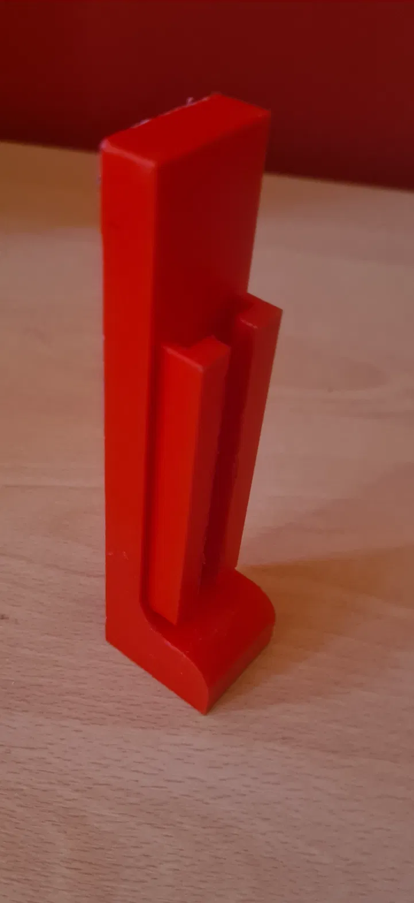
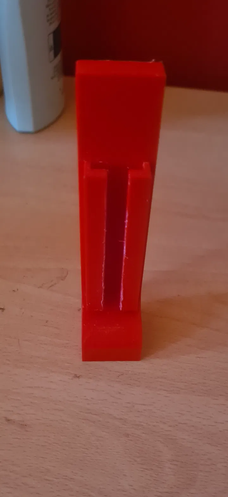

# Camera mount

SolidWorks source files for the 3D-printed camera mount are **not included** —
add the `.SLDPRT` / `.STL` files here if you still have them.

Two designs were produced:

- **L-bracket** — holds the Pi and Camera Module 3 at a fixed orientation.
- **Tripod** — taller, and allows the ribbon cable to be removed without
  disassembling the mount. This is the design that was printed and used.

Print settings: PETG, 0.1mm layer height, 20–25% infill, supports and brim.

## Design

## Printed

See `../docs/hardware.md` for why this mattered more than it might appear.
